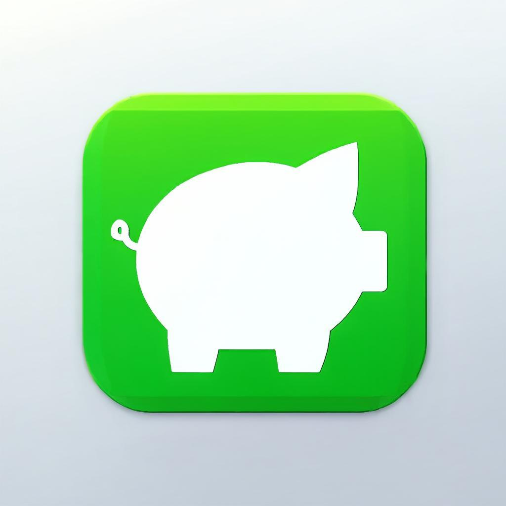
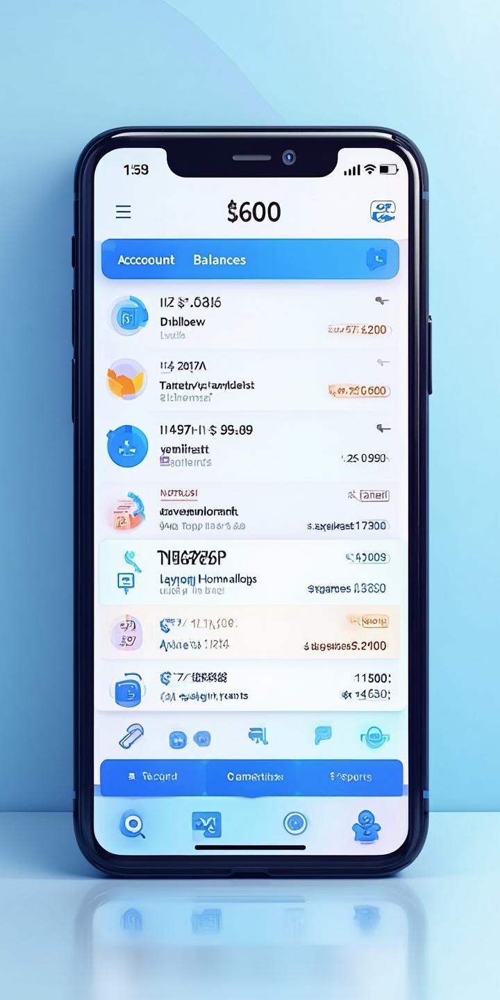
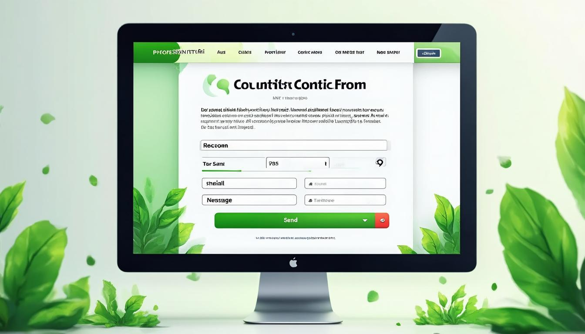

# <div align="center">
  
</div>

<h1 align="center">ButcApp</h1>
<p align="center">
  <strong>Modern Kişisel Muhasebe Uygulaması</strong>
</p>

<p align="center">
  <a href="https://github.com/ahwetekm/ButcApp/stargazers">
    
  </a>
  <a href="https://github.com/ahwetekm/ButcApp/network/members">
    
  </a>
  <a href="https://github.com/ahwetekm/ButcApp/blob/main/LICENSE">
    
  </a>
  <a href="https://github.com/ahwetekm/ButcApp/issues">
    
  </a>
</p>

<p align="center">
  <em>Finansal geleceğinizi bugün yönetmeye başlayın!</em>
</p>

## 📖 Hakkında

ButcApp, kişisel finans yönetimini basitleştiren modern ve kullanıcı dostu bir web uygulamasıdır. Karmaşık arayüzlerden sıkılan kullanıcılar için tasarlanan ButcApp, tüm finansal işlemlerinizi tek bir yerden yönetmenizi sağlar.

### 🎯 Misyonumuz

Kişisel finans yönetimini herkes için erişilebilir, anlaşılır ve keyifli hale getirmek. Karmaşık sayılar ve tablolar yerine, sade ve basit bir arayüz sunarak finansal farkındalığı artırmak.

## ✨ Özellikler

### 💰 **Akıllı Bakiye Takibi**
- 3 farklı hesap türü (Nakit, Banka, Birikim)
- Anlık bakiye görüntüleme
- Detaylı işlem geçmişi

### 🔄 **Otomatik İşlemler**
- Düzenli gelir/gider otomasyonu
- Maaş, kira, kredi gibi tekrarlayan işlemler
- Otomatik hatırlatıcılar

### ⚡ **Anında Transfer**
- Hesaplar arasında hızlı para transferi
- Anında işlem onayı
- Transfer geçmişi takibi

### 📊 **Detaylı Raporlar**
- Gelir-gider analizi
- Kategori bazlı harcama raporları
- Aylık/yıllık finansal özetler
- Pasta, çubuk ve çizgi grafikler
- Hesap dağılım görselleştirmeleri

### 🎨 **Modern Tasarım**
- Minimalist ve kullanıcı dostu arayüz
- Açık ve koyu tema desteği
- Responsive tasarım (Masaüstü, Tablet, Mobil)
- Yumuşak animasyonlar ve geçişler

### 🔒 **Güvenlik**
- %100 yerel veri saklama
- Kişisel bilgilerin güvende kalması
- Hiçbir üçüncü parti veri paylaşımı

## 🚀 Kurulum

### Gereksinimler

- Node.js 18+ 
- npm veya yarn

### Adım 1: Projeyi Klonlayın

```bash
git clone https://github.com/ahwetekm/ButcApp.git
cd ButcApp
```

### Adım 2: Bağımlılıkları Yükleyin

```bash
npm install
```

### Adım 3: Geliştirme Sunucusunu Başlatın

```bash
npm run dev
```

Uygulama [http://localhost:3000](http://localhost:3000) adresinde çalışacaktır.

### Adım 4: Production için Build

```bash
npm run build
npm start
```

## 📱 Ekran Görüntüleri

### Desktop Görünüm
<div align="center">
  
</div>

### Mobil Görünüm
<div align="center">
  
</div>

### Grafik ve İstatistikler
<div align="center">
  
</div>

## 📊 Grafik ve İstatistik Özellikleri

ButcApp, finansal verilerinizi görselleştirmek için zengin grafik seçenekleri sunar:

### 🥧 Hesap Dağılımı (Pasta Grafiği)
- Nakit, banka ve birikim hesaplarınızın dağılımını gösterir
- Yüzde oranları ile hangi hesapta ne kadar paranız olduğunu anında görün
- Renk kodlu görselleştirme ile kolay okunabilirlik

### 📊 Gelir/Gider Karşılaştırması (Çubuk Grafiği)
- Toplam gelir ve giderlerinizi yan yana karşılaştırın
- Finansal dengenizi tek bakışta görün
- Anlaşılır renk kodlaması (yeşil: gelir, kırmızı: gider)

### 📈 Aylık Harcama Trendi (Çizgi Grafiği)
- Son 6 aylık gelir, gider ve net tutar trendlerini izleyin
- Finansal alışkanlıklarınızın zaman içindeki değişimini görün
- Gelecek için daha iyi bütçe planlaması yapın

### 🎯 Grafik Özellikleri
- **Responsive Tasarım**: Tüm cihazlarda mükemmel görünüm
- **İnteraktif Tooltip**: Grafikler üzerinde detaylı bilgi
- **Modern Animasyonlar**: Smooth geçişler ve hover efektleri
- **Koyu/Açık Tema Uyumu**: Tüm temalarda okunabilirlik
- **Gerçek Zamanlı Veri**: İşlemleriniz anında grafiklere yansır

## 🛠️ Teknoloji Stack

| Teknoloji | Açıklama |
|-----------|----------|
| **Next.js 15** | React framework for production |
| **TypeScript 5** | Type-safe JavaScript |
| **Tailwind CSS 4** | Utility-first CSS framework |
| **shadcn/ui** | Modern UI component library |
| **Lucide React** | Beautiful icon library |
| **Next Themes** | Dark/light mode support |
| **Framer Motion** | Smooth animations |

## 🏗️ Proje Yapısı

```
src/
├── app/                    # Next.js App Router
│   ├── globals.css        # Global styles
│   ├── layout.tsx         # Root layout
│   └── page.tsx           # Homepage
├── components/            # Reusable components
│   ├── ui/               # shadcn/ui components
│   ├── theme-provider.tsx # Theme context
│   └── theme-toggle.tsx   # Theme switcher
└── lib/                  # Utilities and helpers
```

## 🎨 Tasarım Prensipleri

### Minimalist Yaklaşım
- Az ama öz içerik
- Göz yormayan renk paleti
- Temiz ve düzenli arayüz

### Kullanıcı Odaklılık
- Tek tıkla işlem yapabilme
- Anlaşılır navigasyon
- Hızlı performans

### Erişilebilirlik
- Klavye navigasyonu desteği
- Ekran okuyucu uyumluluğu
- Yüksek kontrast oranları

## 🔧 Özelleştirme

### Tema Renklerini Değiştirme

`src/app/globals.css` dosyasında CSS değişkenlerini düzenleyin:

```css
:root {
  --primary: oklch(0.205 0 0); /* Ana renk */
  --background: oklch(1 0 0); /* Arka plan */
  /* ... */
}
```

### Yeni Özellik Ekleme

1. Yeni component oluşturun: `src/components/`
2. Sayfaya ekleyin: `src/app/page.tsx`
3. Stilleri düzenleyin: `src/app/globals.css`

## 🤝 Katkıda Bulunma

Katkılarınızı bekliyoruz! Lütfen aşağıdaki adımları izleyin:

1. Fork yapın
2. Feature branch oluşturun: `git checkout -b feature/amazing-feature`
3. Değişikliklerinizi commit edin: `git commit -m 'Add amazing feature'`
4. Branch'e push edin: `git push origin feature/amazing-feature`
5. Pull Request oluşturun

### Katkı Kuralları

- Kodunuzu Prettier ile formatlayın
- TypeScript kurallarına uyun
- Test yazın (mümkünse)
- Commit mesajlarını anlaşılır yazın

## 📄 Lisans

Bu proje MIT Lisansı altında lisanslanmıştır. Detaylar için [LICENSE](LICENSE) dosyasına bakın.

## 🙏 Teşekkürler

- [Next.js](https://nextjs.org/) - React framework
- [Tailwind CSS](https://tailwindcss.com/) - CSS framework
- [shadcn/ui](https://ui.shadcn.com/) - UI components
- [Lucide](https://lucide.dev/) - Icon library

## 📞 İletişim

### 📧 İletişim Formu Özellikleri
- **Modern Arayüz**: Kullanıcı dostu ve responsive tasarım
- **Kategori Bazlı**: Öneri, Şikayet, Hata Bildirimi, Özellik Talebi
- **Otomatik Entegrasyon**: Mailto linki ile doğrudan mail gönderimi
- **Form Doğrulama**: Zorunlu alanlar ve geçerlilik kontrolleri
- **Durum Bildirimleri**: Başarı ve hata mesajları
- **Güvenli**: Sunucu taraflı veri saklama yok

### 📞 Formspree Entegrasyonu
- **Ücretsiz Servis**: Formspree ile 50 form/ay, 1000 gönderim/ay
- **Güvenli Gönderim**: HTTPS ile şifrelenmiş veri transferi
- **Otomatik Yanıtlar**: Formspree dashboard üzerinden yanıt yönetimi
- **Spam Filtreleme**: Built-in spam koruması
- **Dosya Yükleme**: Drag & drop, 5MB limiti, çoklu format desteği
- **Dosya Önizlemi**: Yüklenen dosyanın adını gösterme ve silme
- **Güvenli Yükleme**: Formspree üzerinden güvenli şifreleme

### Dosya Yükleme Ekran Görüntüsü
<div align="center">
  
</div>

### Formspree Formu Ekran Görüntüsü
<div align="center">
  
</div>

### 📞 İletişim Kanalları
- **İletişim Formu**: Site üzerinden doğrudan mesaj gönderin
- **E-posta**: [ahwetze@proton.me](mailto:ahwetze@proton.me)
- **Proje Linki**: [https://github.com/ahwetekm/ButcApp](https://github.com/ahwetekm/ButcApp)
- **Issues**: [https://github.com/ahwetekm/ButcApp/issues](https://github.com/ahwetekm/ButcApp/issues)
- **Discussions**: [https://github.com/ahwetekm/ButcApp/discussions](https://github.com/ahwetekm/ButcApp/discussions)

### İletişim Formu Ekran Görüntüsü
<div align="center">
  
</div>

---

<div align="center">
  <p>
    <strong>⭐ Eğer projeyi beğendiyseniz, lütfen yıldız vermeyi unutmayın!</strong>
  </p>
  <p>
    Made with ❤️ by <a href="https://github.com/ahwetekm">ahwetekm</a>
  </p>
</div>
# Updated git configuration
